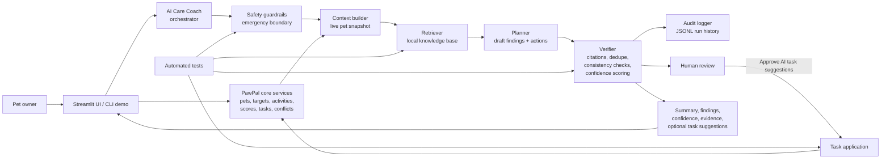
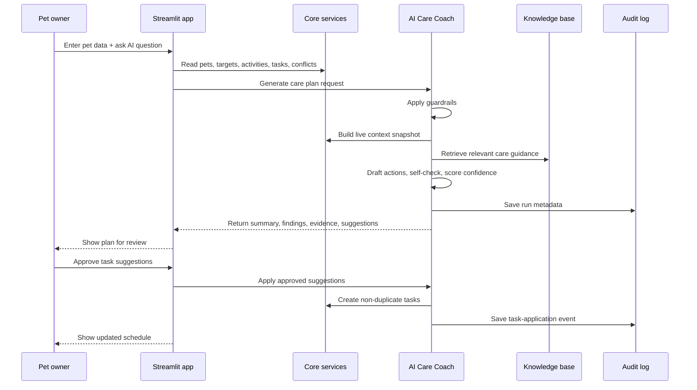

# System Diagram

This page contains the primary system diagram for the PawPal+ AI Care Coach. It shows the main components, the runtime data flow from input to output, and where humans and testing are involved.

## Architecture Diagram

## Runtime Data Flow

## What the Diagram Highlights

- `Input -> process -> output`: owner request and live app data flow through retrieval, planning, verification, and back to the UI.
- `Human-in-the-loop control`: the owner reviews the AI output before any suggested tasks are added.
- `Testing and reliability`: automated tests target the retriever, guardrails, verifier, and task application steps.
