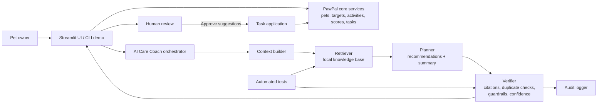

# PawPal+ AI Care Coach: System Overview

## Problem

The original app tracked pet care tasks, activities, and scores, but it still left the owner to interpret the data alone. The new system solves a more meaningful problem: it turns routine-care data into an evidence-backed action plan that explains what needs attention, why it matters, and which next tasks are worth adding.

## Main AI Features

- Retrieval-Augmented Generation (RAG): the coach retrieves relevant local pet-care guidance before producing a plan.
- Agentic workflow: the coach gathers context, retrieves evidence, drafts actions, self-checks them, scores confidence, and only then returns a plan.
- Reliability system: tests, confidence scoring, audit logging, duplicate-task prevention, and safety guardrails are built into the workflow.

## Short System Diagram

## Data Flow

1. Input:
   The owner enters pet data, care targets, activity logs, scheduled tasks, and an AI question such as "What needs attention this week?"
2. Process:
   The coach reads live pet context from the app, retrieves relevant routine-care notes from the local knowledge base, drafts actions, then runs a self-check that blocks urgent health prompts, removes unsupported actions, avoids duplicate tasks, and assigns a confidence score.
3. Output:
   The app returns a summary, findings, evidence citations, warnings, confidence, and optional task suggestions that the owner can approve.

## Main Components

- `app.py`: Streamlit interface, including the new `AI Care Coach` tab and the human approval step before applying tasks.
- `pawpal_system.py`: existing domain services for pets, care targets, activities, care scores, scheduling, recurrence, and conflict detection.
- `pawpal_ai.py`: the new AI engine that runs retrieval, planning, verification, confidence scoring, and logging.
- `knowledge_base/pet_care_knowledge.json`: local grounded knowledge used by the retriever.
- `tests/test_pawpal_ai.py`: automated reliability tests for the new AI workflow.

## Human and Testing Roles

- Human review happens before any AI-generated task is added to the schedule. The AI never silently changes the user's schedule.
- Automated tests verify retrieval, guardrails, task deduplication, and logging.
- Manual review is still important for tone, usefulness, and whether the plan feels appropriately cautious.
